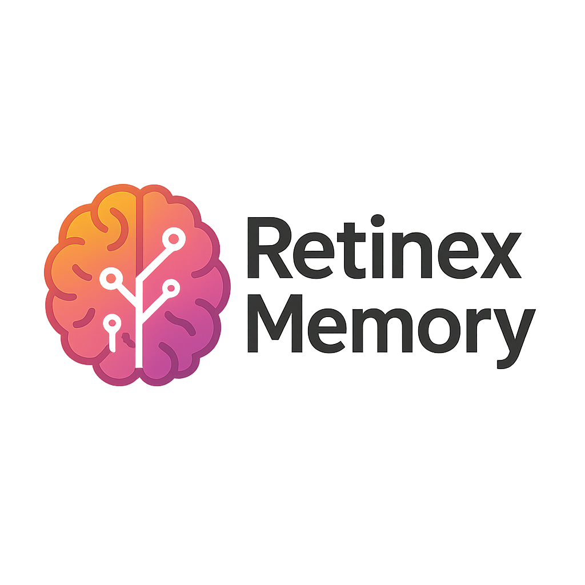

# Enhancing Low-Light Image Quality: A Multi-Granularity Memory Approach with RetinexMemory

<div align="center">
<p align="center">  </p>
</div>

---
[](https://doi.org/10.5281/zenodo.17061404)
## Introduction
This repository contains the official implementation of **RetinexMemory**, a memory-augmented Retinex-based Transformer for **Low-Light Image Enhancement (LLIE)**.  
Our method introduces **multi-granularity memory branches** (part, instance, semantic) into Retinexformer, achieving improved image quality under challenging low-light conditions.  

We provide:  
- Training and testing code  
- Pre-trained models for LOL-v1 and LOL-v2 datasets  
- Reproduction instructions for reported results (PSNR / SSIM / RMSE)  

---

## 1. Environment Setup

We recommend **Python 3.8** and **PyTorch ≥ 1.11**.  

```bash
conda create -n retinexmemory python=3.8 -y
conda activate retinexmemory

# install pytorch (choose cudatoolkit version according to your GPU driver)
conda install pytorch torchvision torchaudio pytorch-cuda=11.8 -c pytorch -c nvidia

# other dependencies
pip install matplotlib scikit-learn scikit-image opencv-python yacs joblib natsort h5py tqdm tensorboard einops addict future lmdb numpy pyyaml requests scipy yapf lpips thop timm
```

Install BasicSR:  

```bash
python setup.py develop --no_cuda_ext
```

---

## 2. Dataset Preparation

We use two standard benchmarks: **LOLv1** and **LOLv2 (real & synthetic)**.  
- [LOLv1_Baidu_Disk](https://pan.baidu.com/share/init?surl=ZAC9TWR-YeuLIkWs3L7z4g&pwd=cyh2) (code:cyh2)
- [LOLv2_Baidu_Disk](https://pan.baidu.com/share/init?surl=X4HykuVL_1WyB3LWJJhBQg&pwd=cyh2) (code:cyh2)
- [LOLv1 Google Drive](https://drive.google.com/file/d/1L-kqSQyrmMueBh_ziWoPFhfsAh50h20H/view?usp=sharing)  
- [LOLv2 Google Drive](https://drive.google.com/file/d/1Ou9EljYZW8o5dbDCf9R34FS8Pd8kEp2U/view?usp=sharing)  


Organize them as:  

```
|--data   
|    |--LOLv1
|    |    |--Train
|    |    |    |--input
|    |    |    |--target
|    |    |--Test
|    |         |--input
|    |         |--target
|    |
|    |--LOLv2
|    |    |--Real_captured
|    |    |    |--Train
|    |    |    |--Test
|    |    |--Synthetic
|    |         |--Train
|    |         |--Test
```

---

## 3. Testing

Run testing:  

```bash
# LOL-v1
python3 Enhancement/test_from_dataset.py --opt Options/RetinexMemory_LOLv1.yml --weights experiments/RetinexFormer_LOL_v1/best.pth --dataset LOL_v1

# LOL-v2-real
python3 Enhancement/test_from_dataset.py --opt Options/RetinexMemory_LOLv2_real.yml --weights experiments/RetinexFormer_LOL_v2_real/best.pth --dataset LOL_v2_real

# LOL-v2-synthetic
python3 Enhancement/test_from_dataset.py --opt Options/RetinexMemory_LOLv2_syn.yml --weights experiments/RetinexFormer_LOL_v2_synthetic/best.pth --dataset LOL_v2_syn
```


📌 **Note**: You only need to change the dataset path in `test.py` to reproduce the results.  
The script automatically computes **PSNR / SSIM / RMSE**.  


## 4. Training

To train from scratch:  

```bash
# LOL-v1
python3 basicsr/train.py --opt Options/RetinexMemory_LOLv1.yml

# LOL-v2-real
python3 basicsr/train.py --opt Options/RetinexMemory_LOLv2_real.yml

# LOL-v2-synthetic
python3 basicsr/train.py --opt Options/RetinexMemory_LOLv2_syn.yml
```

Training details:  
- Iterations: **100,000**  
- Batch size, LR schedule, and other settings are specified in the `.yml` configs under `Options/`.  
- Mixed precision (`use_amp`) is supported for faster training and lower GPU memory usage.  


